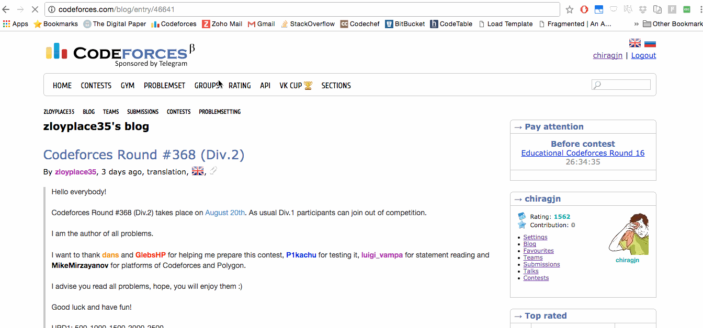

# Codeforces Comments Collapser Web Extension

Add-on/Extension for Chrome/Mozilla

For Chrome, you can enable Developer Mode on `chrome://extensions` and then drag drop the file `dist/ccc.crx`

For other browsers, please refer to their docs on how to install an extension from its source.

